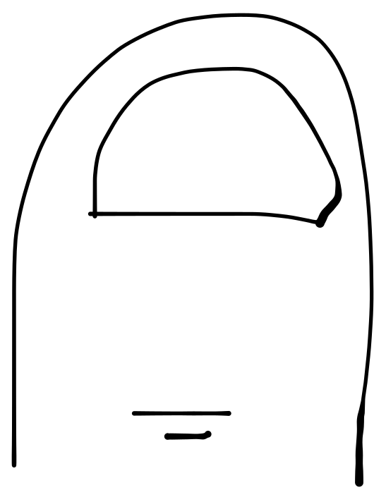

#  Dedu - Permissions deduplication tool for Apache Kafka®
A heuristic deduplication ACL tool 

[](https://github.com/tomasalmeida/dedu-permissions-deduplication/actions/workflows/main-ci.yml)

The idea of Dedu is allow any Apache Kafka operator to visualize the ACLs bindings in the cluster and perform cleaning if needed.

## Introduction
Dedu has three rules (more to come) to deduplicate the ACLs:
* Deleted Topic rule: as the deletion of a topic and an ACL binding can happen without sync, the cluster can keep old bindings that do not match any resource in the cluster.
* Redundant Binding rule: in ACL binding, the binding can be done LITERAL or PREFIXED. If a prefix binding also contains a literal one, the literal binding could be deleted.
  * Example: cluster has the rule READ for topic `topic-name-aaa` and also, a prefix READ rule for prefix `topic-name`, the literal rule is included in the prefixed rule.
* Consolidate literal bindings rule (experimental): several literal bindings can be consolidated in one prefixed binding rule.
  * More details how to activate this rule is provided below.
  * The reason of this feature is being experimental is the amount of memory and cpu needed to analyse the combinations to reduce the bindings.

## Usage

```shell
java -jar dedu-x.y.z.jar <parameters>
```

### All parameters

| Parameter                 | Required | Description                                                  |
|---------------------------|----------|--------------------------------------------------------------|
| --help                    |   NO     | Show all parameters                                          |
| --dedu-config-file <arg>  |   YES    | Dedu Config file path (with Dedu configuration properties)   |
| --kafka-config-file <arg> |   YES    | Kafka Config file path (with Kafka configuration properties) |
| --principal <arg>         |   NO     | Optimize permissions for this given principal                |

### Dedu config file properties

None of the properties are required and the default value is used in case the property is not provided.

| Property                                               | Accepted values                 | Default Value    | Description                                                                              |
|--------------------------------------------------------|---------------------------------|------------------|------------------------------------------------------------------------------------------|
| log.level                                              | TRACE, DEBUG, INFO, WARN, ERROR | INFO             | Log output level                                                                         |
| acl.current.output.log.enable                          | true / false                    | false            | Output the current bindings to the output log (debug mode only)                          |
| acl.current.output.csv.enable                          | true / false                    | false            | Output the current bindings to a CSV file                                                |
| acl.current.output.csv.path                            | any path                        | ./current.csv    | Path to save the CSV current bindings                                                    |
| acl.actionable.output.log.enable                       | true / false                    | false            | Output the actionable bindings to the output log (debug mode only)                       |
| acl.actionable.output.csv.enable                       | true / false                    | false            | Output the actionable bindings a CSV file                                                |
| acl.actionable.output.csv.path                         | any path                        | ./actionable.csv | Path to save the CSV actionable bindings                                                 |
| rule.consolidate.literal.topic.bindings.enabled        | true / false                    | false            | Enable experimental rule to consolidate several literal bindings into one prefix binding |
| rule.consolidate.literal.topic.bindings.prefix.min     | number bigger than 3            | 3                | Minimum size of the prefix                                                               |
| rule.consolidate.literal.topic.bindings.replaced.min   | number bigger than 2            | 2                | Minimum number of replaced bindings to allow consolidation                               |

## Example

### For all principals
```shell
  mvn clean package
  cd examples/sasl-plain-cluster
  ./startCluster.sh
  cd ../..
  java -jar target/dedu-x.y.z.jar --kafka-config-file examples/sasl-plain-cluster/clients/kafka-user.properties --dedu-config-file examples/dedu.properties
```

### For one specific user
```shell
  mvn clean package
  cd examples/sasl-plain-cluster
  ./startCluster.sh
  cd ../..
  java -jar target/dedu-x.y.z.jar --kafka-config-file examples/sasl-plain-cluster/clients/kafka-user.properties --dedu-config-file examples/dedu.properties --principal User:alice
```

## DISCLAIMER

Licensed under the Apache License, Version 2.0 (the "License");
you may not use this file except in compliance with the License.
You may obtain a copy of the License at

http://www.apache.org/licenses/LICENSE-2.0

Unless required by applicable law or agreed to in writing, software
distributed under the License is distributed on an "AS IS" BASIS,
WITHOUT WARRANTIES OR CONDITIONS OF ANY KIND, either express or implied.
See the License for the specific language governing permissions and
limitations under the License.

Copyright 2024 - Tomás Dias Almeida
